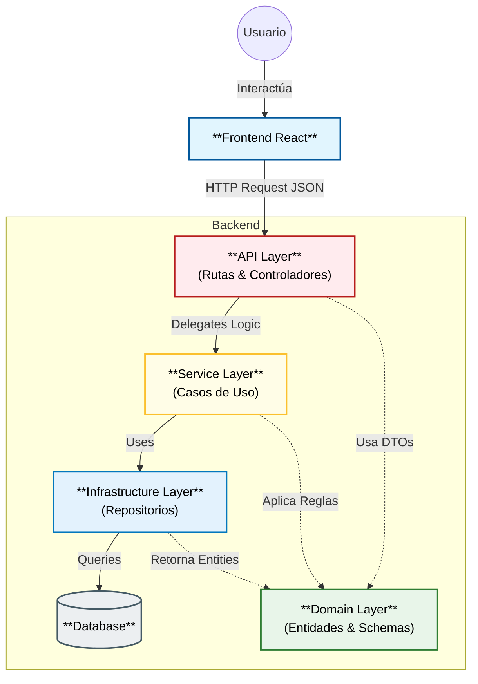
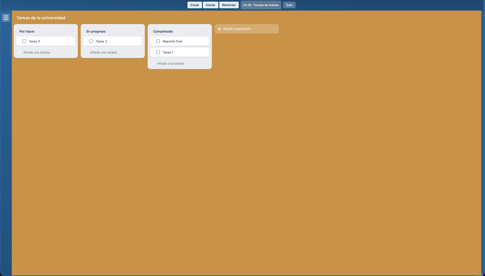

# 🚀 TaskFlow (Trello Clone)

<div align="center">
  
  
  
  
  
</div>

<br />

<p align="center">
  <strong>Un sistema de gestión de tareas estilo Kanban diseñado para la productividad y colaboración visual.</strong>
</p>

<p align="center">
  <a href="#-demo">Ver Demo</a> •
  <a href="#-arquitectura">Arquitectura</a> •
  <a href="#-instalación-y-ejecución">Instalación</a> •
  <a href="#-documentación-api">API Docs</a>
</p>

---

## 🎯 Sobre el Proyecto

Este proyecto no es solo un "To-Do List". Es una implementación completa de un sistema **Kanban interactivo** que resuelve problemas de gestión de estado complejo en el frontend y relaciones de datos jerárquicas en el backend.

El objetivo principal fue construir una aplicación **Full Stack** robusta, aplicando principios de **Clean Architecture** y patrones de diseño modernos.

### ✨ Funcionalidades Clave

- **🔄 Drag & Drop Avanzado:** Implementado con `dnd-kit` para una experiencia fluida sin re-renders innecesarios.
- **🔐 Seguridad Robusta:** Autenticación vía **JWT (JSON Web Tokens)** con hashing de contraseñas (`bcrypt`) y protección de rutas middleware.
- **⚡ API de Alto Rendimiento:** Backend construido con **FastAPI** para respuestas asíncronas y validación automática de datos con Pydantic.
- **📱 UI Reactiva:** Frontend en **React 18** con gestión de estado global y optimistic updates para una sensación de inmediatez.

---

## 🏗️ Arquitectura

El sistema sigue una arquitectura cliente-servidor desacoplada (REST API):



### Decisiones Técnicas

| Tecnología | Rol | ¿Por qué esta elección? |
| --- | --- | --- |
| **FastAPI** | Backend | Por su soporte nativo de asincronía (async/await) y su velocidad superior a Flask/Django en I/O bound tasks. |
| **SQLAlchemy** | ORM | Permite abstraer las consultas SQL y facilita la migración futura a PostgreSQL sin cambiar lógica de negocio. |
| **dnd-kit** | Drag & Drop | A diferencia de `react-beautiful-dnd`, es modular, ligero y soporta mejor los eventos táctiles y de accesibilidad. |
| **JWT** | Auth | Stateless authentication. Ideal para escalabilidad horizontal ya que no requiere guardar sesiones en servidor. |

---

## 🖼️ Demo

<div align="center">
<table>
<tr>
<td align="center"><strong>Login Seguro</strong></td>
<td align="center"><strong>Tablero Interactivo</strong></td>
</tr>
<tr>
<td></td>
<td></td>
</tr>
</table>
<p><em>Gestión de tarjetas con Drag and Drop fluido</em></p>

</div>

---

## 🔧 Instalación y Ejecución

### Prerrequisitos

* Node.js 18+
* Python 3.9+
* Git

### 1. Clonar el repositorio

```bash
git clone [https://github.com/PGPLAYER15/clon-trello.git](https://github.com/PGPLAYER15/clon-trello.git)
cd clon-trello

```

### 2. Configurar Backend (FastAPI)

```bash
cd backend
python -m venv venv

# Windows
venv\Scripts\activate
# Mac/Linux
source venv/bin/activate

pip install -r requirements.txt

# Iniciar servidor
uvicorn app.main:app --reload --port 8003

```

### 3. Configurar Frontend (React)

```bash
cd frontend
npm install
npm run dev

```

🚀 **Acceso:**

* App: `http://localhost:5173`
* Swagger Docs: `http://localhost:8003/docs`

---

## 📂 Estructura del Proyecto

La estructura sigue el patrón de **Separation of Concerns**:

```
├── backend/
│   ├── app/
│   │   ├── domain/           #  Capa de Dominio (Entities & Schemas)
│   │   ├── infrastructure/   #  Capa de Infraestructura (Repositories & DB)
│   │   ├── services/         #  Capa de Aplicación (Business Logic)
│   │   ├── api/              #  Capa de Presentación (Rutas/Endpoints)
│   │   └── core/             #  Configuración (Auth, Env, DI)
│   └── trello.db
│
├── frontend/
│   ├── src/
│   │   ├── components/   # UI Reutilizable
│   │   ├── context/      # Estado Global (Auth)
│   │   ├── hooks/        # Lógica encapsulada
│   │   └── services/     # Capa de API (Axios)

```

---

## 📡 API Endpoints

Documentación completa disponible en `/docs` (Swagger UI). Endpoints principales:

### 🔐 Auth

* `POST /api/auth/login` - Obtener Access Token
* `POST /api/auth/register` - Crear cuenta

### 📋 Gestión

* `GET /api/boards/` - Listar tableros del usuario
* `POST /api/lists/` - Crear columna
* `PUT /api/cards/{id}` - Mover tarjeta (Drag & Drop update)

---

## 🚀 Retos y Aprendizajes

Durante el desarrollo, los desafíos más interesantes fueron:

1. **Sincronización de Estado (Frontend):** Mantener la UI actualizada instantáneamente al soltar una tarjeta (Optimistic UI) mientras se confirma la petición en el backend.
2. **Relaciones en Cascada (Backend):** Diseñar los modelos de SQLAlchemy para asegurar que al borrar una Lista, se borren sus Tarjetas asociadas correctamente.


---

<p align="center">
Hecho con 💻 y ☕ por <a href="https://github.com/PGPLAYER15">Marco Palazuelos</a>
</p>


-----

